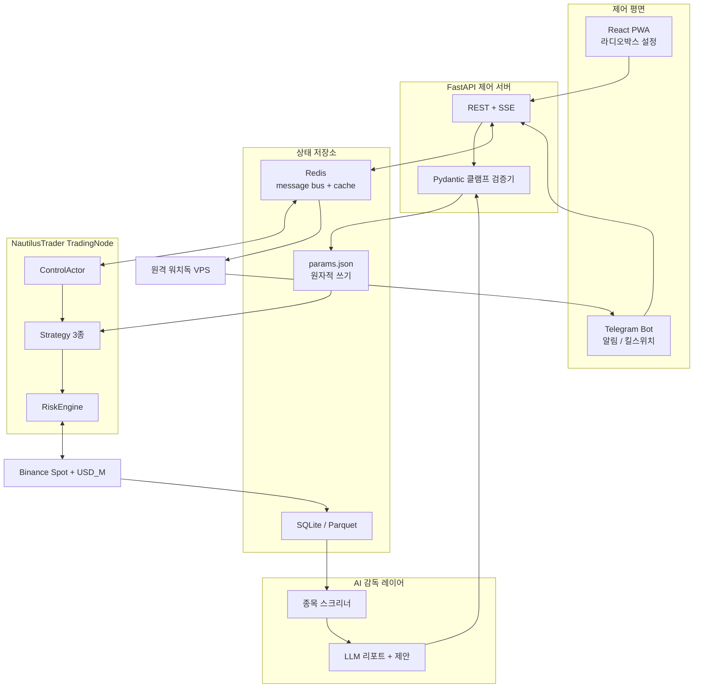

# helm-trader

로컬 Mac mini에서 24시간 동작하는 Binance 자동매매 엔진.
실행 경로는 결정론적 룰베이스이고, AI는 하루 1회 파라미터 제안과 종목 추천만 한다.
사용자는 웹 대시보드의 라디오박스로 시장/전략/리스크를 지정하고, 휴대폰 텔레그램 버튼으로 즉시 중단하거나 재개한다.

> **핵심 원칙:** AI는 제안자, 검증기가 게이트키퍼, 엔진은 AI 없이도 돈다.

---

## 목차

1. [개요와 설계 철학](#1-개요와-설계-철학)
2. [시스템 아키텍처](#2-시스템-아키텍처)
3. [기술 스택과 선정 근거](#3-기술-스택과-선정-근거)
4. [프로젝트 디렉토리 구조](#4-프로젝트-디렉토리-구조)
5. [사용자 제어 스펙](#5-사용자-제어-스펙)
6. [전략 상세](#6-전략-상세)
7. [AI 레이어](#7-ai-레이어)
8. [리스크 관리](#8-리스크-관리)
9. [안전장치와 장애 대응](#9-안전장치와-장애-대응)
10. [백테스트 방법론](#10-백테스트-방법론)
11. [개발 로드맵](#11-개발-로드맵)
12. [설치 및 운영](#12-설치-및-운영)
13. [기술적 한계](#13-기술적-한계)
14. [법·세무 주의](#14-법세무-주의)
15. [기대 성과 보정](#15-기대-성과-보정)
16. [면책 조항](#16-면책-조항)

---

## 1. 개요와 설계 철학

### 1.1 무엇을 만드는가

helm-trader는 클라우드가 아닌 **로컬 Mac mini**에서 돌아가는 Binance Spot / USDⓈ-M Futures 자동매매 시스템이다. 사용자가 원하는 것은 다음 네 가지다.

| 요구 | 구현 방식 |
| --- | --- |
| 완전 자동화 + AI 접목 | 3계층 분리. AI는 실행 경로에 없음 |
| 종목 추천 / 현물 / 선물 선택 | 웹 대시보드 라디오박스 → `params.json` |
| 휴대폰 원터치 중단/재개 + 알림 | 텔레그램 인라인 키보드 + 하트비트 |
| 매일 수익률 보고서와 전략 재수립, 토큰 없어도 동작 | 일일 배치가 `params.json`만 갱신. 실패 시 직전 파라미터 유지 |

### 1.2 통제할 수 있는 것과 없는 것

**수익률은 지정할 수 없다.** 지정할 수 있는 것은 리스크(회당 손실 한도, 레버리지 상한, 일일 서킷브레이커, 최대 드로다운)다. 목표 수익률을 시스템 파라미터로 넣으면 미달 시 레버리지를 올리는 로직이 되고, 이는 청산으로 직결된다. 대시보드에는 "목표 수익률" 입력란이 없다. 대신 `risk_grade` 라디오박스만 제공한다.

### 1.3 3계층 분리

```
[Layer 3] 전략 감독 (AI, 느림, 하루 1회)
    ↓ params.json (원자적 쓰기, Pydantic 클램프)
[Layer 2] 실행 엔진 (NautilusTrader, 24/7, 결정론)
    ↓ REST / WebSocket
[Layer 1] Binance + 거래소 측 조건부 주문
```

- **Layer 1:** 포지션을 열 때마다 `StopMarket` + `close_position=true`를 거래소에 건다. Mac mini가 정전으로 꺼져도 손절은 Binance가 실행한다.
- **Layer 2:** `params.json`에 적힌 값만 읽어 결정론적으로 동작한다. LLM API가 죽어도, 토큰이 없어도, 인터넷의 AI 엔드포인트가 없어도 마지막 파라미터로 무한히 돈다.
- **Layer 3:** 어제 거래 로그 + 시장 레짐 지표 + 뉴스 요약을 읽고 리포트를 만들고, **제한된 범위 안에서만** 파라미터를 제안한다. AI가 레버리지 20배를 제안해도 검증기가 `leverage <= 3`에서 거부한다.

### 1.4 왜 NautilusTrader인가

개인이 처음부터 주문 멱등성, 재시작 리컨실, 리스크 엔진, 현물/선물 어댑터를 직접 짜면 버그가 거기서 난다. NautilusTrader는 Rust 코어 + Python 제어면이고, Binance Spot / USD_M 어댑터가 `stable`이며, 백테스트와 라이브가 같은 전략 코드를 공유한다(research-to-live parity). 이 프로젝트의 실행 엔진은 NautilusTrader `TradingNode`다.

---

## 2. 시스템 아키텍처

### 2.1 전체 구조



### 2.2 데이터 흐름

1. **시세:** Binance WebSocket → Nautilus DataClient → Strategy.on_bar / on_quote. REST 폴링은 재연결·리컨실에만 쓴다.
2. **체결/포지션:** User Data Stream → ExecutionClient → Cache. 재시작 시 거래소 조회가 진실의 원천이다.
3. **사용자 명령:** PWA 또는 텔레그램 → FastAPI → 검증기 → `params.json` 원자적 교체 + Redis 토픽 `helm.control` 발행 → ControlActor가 즉시 반영.
4. **AI 배치:** 매일 정해진 시각(기본 08:00 KST)에 screener가 정량 필터를 돌리고, LLM이 리포트와 파라미터 제안을 만든다. 제안은 검증기를 통과해야만 반영된다. 실패하면 직전 `params.json`을 그대로 두고 텔레그램에 "AI 배치 스킵, 엔진 정상 가동 중"을 보낸다.
5. **하트비트:** TradingNode가 15초마다 Redis 키 `helm.heartbeat`를 갱신한다. 원격 VPS 워치독이 45초 이상 끊기면 텔레그램 경고를 보내고, 90초면 "연결 유실, 거래소 측 손절만 유효"를 알린다.

### 2.3 프로세스 구성 (Mac mini)

| 프로세스 | 역할 | 재시작 |
| --- | --- | --- |
| `helm-engine` | NautilusTrader TradingNode | launchd KeepAlive |
| `helm-api` | FastAPI + SSE | launchd KeepAlive |
| `helm-bot` | 텔레그램 봇 long-poll | launchd KeepAlive |
| `helm-ai` | 일일 배치 (launchd StartCalendarInterval) | 실패해도 엔진에 영향 없음 |
| `redis-server` | message bus / cache | launchd KeepAlive |

웹 프론트는 빌드된 정적 파일을 FastAPI가 서빙한다. 별도 Node 프로세스는 운영에 두지 않는다.

### 2.4 네트워크 경계

- Binance API: Mac mini 공인 IP를 API 키 화이트리스트에 등록. ISP IP 변경 시 키 무효화 → 운영 문서에 IP 변경 대응 절차를 둔다.
- 웹 대시보드: 공인 인터넷에 열지 않는다. **Tailscale**로 폰/노트북만 접속.
- 텔레그램: outbound HTTPS만. inbound 포트 불필요.
- 워치독 VPS: Redis heartbeat만 읽고, 거래소 API 키는 갖지 않는다. 청산 권한은 로컬 ControlActor와 거래소 조건부 주문에만 있다.

---

## 3. 기술 스택과 선정 근거

### 3.1 확정 스택

| 영역 | 선택 | 이유 |
| --- | --- | --- |
| 실행 엔진 | `nautilus_trader` | Rust 코어, Binance Spot/USD_M stable 어댑터, DEMO 환경, research-to-live parity, `close_position` 지원 |
| 리서치 / 스위프 | `vectorbt` OSS + `polars` + `pandas-ta` | 대량 파라미터 스위프 속도. 실행에는 쓰지 않음 |
| 제어 서버 | `FastAPI` + `uvicorn` + `pydantic v2` | 라디오박스 스키마와 클램프를 한 모델로 공유 |
| 프론트엔드 | `Vite` + `React` + `TypeScript` + `TailwindCSS` + `shadcn/ui` RadioGroup | PWA, 라디오박스 UX |
| 폰 접속 | `Tailscale` | 고정 IP/공인 노출 불필요 |
| 알림 / 킬스위치 | `python-telegram-bot` | 푸시 + 버튼 + chat_id 화이트리스트가 한 패키지 |
| 상태 | Redis + SQLite WAL + Parquet | Redis는 Nautilus message bus 옵션, SQLite는 주문/체결, Parquet는 OHLCV catalog |
| AI | Anthropic / OpenAI 배치, 폴백 `Ollama` | 하루 1회라 비용 $5~30/월 |
| 프로세스 | macOS `launchd` + `pmset` | Docker Desktop은 Mac에서 오버헤드가 큼 |
| 패키지 | `uv` (Python), `pnpm` (프론트) | 재현 가능한 lockfile |
| 언어 | Python 3.12, TypeScript 5.x | |

### 3.2 엔진 선정 근거 (2026 조사)

| 프레임워크 | 유지보수 (2026) | 라이브 | 이 프로젝트에서의 위치 |
| --- | --- | --- | --- |
| NautilusTrader | 활발 (v1.228.0, 2026-06) | 백테스트와 동일 코드 | **실행 + 확정 백테스트** |
| vectorbt OSS | 유지보수 모드, 개발은 PRO | 없음 (시그널 export만) | **리서치 스위프만** |
| backtrader | 2023부터 사실상 동결 | 노후 연동 | 채택하지 않음 |
| backtesting.py | 활발 | 없음 | 학습용. 실전 검증에 부족 |
| 자체 asyncio 엔진 | — | 직접 구현 | 멱등성·리컨실·리스크를 전부 직접 짜야 함. 기각 |

### 3.3 Binance SDK

NautilusTrader Binance 어댑터가 거래소 I/O를 담당한다. 별도로 `python-binance`나 공식 modular SDK를 실행 경로에 두지 않는다. 리서치 데이터 수집(과거 kline 대량 다운로드)만 공식 REST를 직접 호출해도 된다.

확인된 어댑터 사실:

- `BinanceEnvironment.DEMO`가 신규 권장 (`demo-fstream.binance.com`). `TESTNET`은 레거시. Spot testnet은 `testnet.binance.vision`, RSA 키 미지원.
- `close_position`은 `StopMarket` / `MarketIfTouched`에만 전달 가능. `reduce_only`와 동시 사용 불가. 배치 주문 불가.
- `reduce_only`는 선물만, Hedge Mode에서는 비활성.
- UM+CM 공유 rate limit: **2400 weight/min per IP**, **1200 orders/min + 300 orders/10s per account**.
- `default_taker_fee` 기본값 0.0004.
- Redis 백엔드 cache / message bus는 옵션. 웹 대시보드 연동 통로로 사용한다.

### 3.4 왜 텔레그램 + 웹을 같이 쓰나

라디오박스가 7개 그룹이고 승인 대기 종목 목록이 생기면 텔레그램 인라인 키보드만으로는 UX가 무너진다. 설정은 웹, 긴급 제어와 알림은 텔레그램으로 나눈다.

| 작업 | 표면 |
| --- | --- |
| 시장/전략/리스크/AI 레벨 변경 | PWA 라디오박스 |
| 고정 종목 목록 편집, AI 추천 승인 | PWA |
| 일일 리포트 열람, 차트 | PWA |
| 소프트 정지 / 재개 | 텔레그램 + PWA |
| 하드 킬 (전량 청산 + 정지) | 텔레그램 우선, 2단계 확인 |
| 체결/손절/하트비트 끊김 알림 | 텔레그램 푸시 |

---

## 4. 프로젝트 디렉토리 구조

구현 단계의 목표 트리. 현재 저장소에는 `README.md`만 있다.

```
helm-trader/
├── README.md
├── pyproject.toml
├── uv.lock
├── .env.example
├── .gitignore
├── src/helm/
│   ├── __init__.py
│   ├── config/
│   │   ├── schema.py          # Pydantic params.json 모델, enum, 클램프
│   │   ├── defaults.py        # 등급별 기본값
│   │   └── store.py           # 원자적 쓰기, 버전, 롤백
│   ├── engine/
│   │   ├── node.py            # TradingNode 부트스트랩
│   │   ├── binance.py         # BinanceData/ExecClientConfig
│   │   └── catalog.py         # Parquet catalog
│   ├── strategies/
│   │   ├── trend.py           # 추세추종
│   │   ├── funding_arb.py     # 현물+숏 델타뉴트럴
│   │   └── grid.py            # 횡보 그리드
│   ├── actors/
│   │   └── control_actor.py   # 모드 전환, 전량청산, heartbeat
│   ├── risk/
│   │   ├── sizing.py          # 회당 리스크 % → 수량
│   │   ├── circuit.py         # 일일 손실 / MDD 킬
│   │   └── exchange_stops.py  # close_position 손절 부착
│   ├── ai/
│   │   ├── screener.py        # 정량 필터 (거래대금, ATR, 상장일)
│   │   ├── regime.py          # ADX / 실현변동성 레짐
│   │   ├── proposer.py        # LLM 호출, JSON 스키마 강제
│   │   └── reporter.py        # 일일 HTML/텍스트 리포트
│   ├── api/
│   │   ├── app.py             # FastAPI
│   │   ├── routes_params.py
│   │   ├── routes_control.py
│   │   └── sse.py             # 포지션/PnL 스트림
│   ├── notify/
│   │   └── telegram_bot.py
│   └── research/
│       ├── data.py            # kline 수집
│       ├── sweep.py           # vectorbt 스위프
│       └── walkforward.py
├── web/
│   ├── package.json
│   ├── pnpm-lock.yaml
│   └── src/
│       ├── pages/Dashboard.tsx
│       ├── pages/Settings.tsx # 라디오박스 전면
│       ├── pages/Symbols.tsx
│       └── pages/Reports.tsx
├── ops/
│   ├── launchd/
│   │   ├── com.helm.engine.plist
│   │   ├── com.helm.api.plist
│   │   ├── com.helm.bot.plist
│   │   └── com.helm.ai.plist
│   ├── watchdog/
│   │   └── heartbeat_watch.py # VPS에 배포
│   └── macos/
│       └── disable_sleep.sh   # pmset
├── data/                      # gitignore. params.json, sqlite, parquet
└── tests/
    ├── test_schema_clamp.py
    ├── test_sizing.py
    ├── test_control_actor.py
    └── test_walkforward_smoke.py
```

모듈 경계 규칙:

- `strategies/`는 Binance SDK를 직접 import하지 않는다. Nautilus Strategy API만 사용.
- `ai/`는 주문을 내지 않는다. `config.store`에 제안만 넘긴다.
- `api/`와 `notify/`는 ControlActor에 명령만 발행한다. 포지션을 직접 닫지 않는다.
- `research/`는 라이브 프로세스에 로드되지 않는다.

---

## 5. 사용자 제어 스펙

### 5.1 라디오박스 그룹

각 그룹은 단일 선택이다. UI와 API와 `params.json`이 같은 enum을 공유한다. 클라이언트 검증은 UX용이고, **서버 Pydantic이 최종 게이트**다.

| 키 | 옵션 | 기본 | 의미 |
| --- | --- | --- | --- |
| `market_mode` | `spot` / `futures` / `both` | `futures` | 현물만 / 선물만 / 현물+선물 |
| `symbol_selection` | `ai_auto` / `manual` / `ai_approve` | `ai_approve` | AI 추천 자동 적용 / 사용자 고정 목록 / AI 추천 후 승인 |
| `strategy_mode` | `trend` / `funding_arb` / `grid` / `regime_auto` | `trend` | 단일 전략 또는 레짐 자동 선택 |
| `risk_grade` | `conservative` / `standard` / `aggressive` | `conservative` | 아래 표의 한도 프리셋 |
| `ai_level` | `off` / `params_only` / `params_and_symbols` | `params_only` | AI 끔 / 일일 파라미터만 / 파라미터+종목 |
| `stop_style` | `fixed_pct` / `atr` / `trailing` | `atr` | 손절 계산 방식 |
| `run_state` | `running` / `soft_stop` / `hard_kill` | `running` | 가동 / 신규진입 중단 / 전량청산+정지 |

`hard_kill`은 UI에서 즉시 적용하지 않는다. 확인 토큰을 발급하고 5초 안에 두 번째 요청이 와야 실행한다. 텔레그램도 동일하게 "정말 전량 청산합니까?" 버튼을 한 번 더 누르게 한다.

### 5.2 risk_grade 프리셋 (하드캡 포함)

| 등급 | 레버리지 | 회당 리스크 | 일일 손실 한도 | 포트 MDD 킬 | 동시 포지션 |
| --- | --- | --- | --- | --- | --- |
| conservative | 1x | 0.5% | 2% | 8% | 3 |
| standard | 2x | 1.0% | 4% | 15% | 5 |
| aggressive | 3x | 2.0% | 6% | 25% | 7 |

레버리지 하드캡은 **3x**. 스키마가 `leverage > 3`을 거부한다. AI도 사용자도 우회할 수 없다. 현물 모드에서는 레버리지 필드를 무시한다.

### 5.3 `params.json` 스키마 예시

```json
{
  "version": 17,
  "updated_at": "2026-08-27T08:00:12+09:00",
  "updated_by": "ai_batch",
  "market_mode": "futures",
  "symbol_selection": "ai_approve",
  "strategy_mode": "trend",
  "risk_grade": "conservative",
  "ai_level": "params_only",
  "stop_style": "atr",
  "run_state": "running",
  "symbols": {
    "active": ["BTCUSDT", "ETHUSDT"],
    "pending_approval": ["SOLUSDT"],
    "blacklist": ["USDCUSDT"]
  },
  "strategy": {
    "trend": {
      "timeframe": "15m",
      "donchian_n": 20,
      "atr_n": 14,
      "atr_stop_mult": 2.0,
      "min_adx": 20
    },
    "funding_arb": {
      "min_funding_apr": 0.10,
      "max_basis_bps": 15,
      "rebalance_threshold_bps": 25
    },
    "grid": {
      "timeframe": "5m",
      "grid_atr_mult": 0.4,
      "levels": 6,
      "max_inventory_pct": 30
    }
  },
  "risk": {
    "leverage": 1,
    "per_trade_risk_pct": 0.5,
    "daily_loss_limit_pct": 2.0,
    "portfolio_mdd_kill_pct": 8.0,
    "max_concurrent_positions": 3
  },
  "ai": {
    "last_run_at": "2026-08-27T08:00:12+09:00",
    "last_status": "applied",
    "token_budget_usd_month": 30
  }
}
```

### 5.4 클램프 규칙 (검증기가 강제)

| 필드 | 허용 범위 | 위반 시 |
| --- | --- | --- |
| `risk.leverage` | 1..3 | reject |
| `risk.per_trade_risk_pct` | 0.1..2.0 | clamp 후 apply + warn |
| `risk.daily_loss_limit_pct` | 1.0..8.0 | clamp |
| `risk.portfolio_mdd_kill_pct` | 5.0..30.0 | clamp |
| `strategy.trend.donchian_n` | 10..60 | clamp |
| `strategy.trend.atr_stop_mult` | 1.0..4.0 | clamp |
| `strategy.grid.levels` | 3..12 | clamp |
| `symbols.active` | 거래대금 상위 필터 통과 종목만, 최대 20 | reject 개별 종목 |
| `run_state` | enum만 | reject |

`updated_by`가 `ai_batch`이면 클램프를 통과한 필드만 병합하고, `run_state`와 `risk_grade`와 `market_mode`는 AI가 바꾸지 못한다. 이 세 필드는 사용자 라디오박스 전용이다.

### 5.5 원자적 쓰기

`store.py`는 `params.json.tmp`에 쓴 뒤 `os.replace`로 교체한다. 직전 버전은 `params.json.prev`로 남긴다. 스키마 검증 실패 시 tmp를 버리고 prev를 유지한다. ControlActor는 mtime 또는 Redis 이벤트로 리로드한다.

### 5.6 FastAPI 엔드포인트 (초안)

| 메서드 | 경로 | 설명 |
| --- | --- | --- |
| GET | `/api/params` | 현재 파라미터 |
| PUT | `/api/params` | 라디오박스 변경. 전체 교체가 아니라 허용 필드 패치 |
| GET | `/api/symbols` | active / pending / blacklist |
| POST | `/api/symbols/approve` | pending → active |
| POST | `/api/control/soft-stop` | 신규 진입 중단 |
| POST | `/api/control/resume` | 재개 |
| POST | `/api/control/hard-kill/prepare` | 확인 토큰 발급 |
| POST | `/api/control/hard-kill/confirm` | 전량 청산 + 정지 |
| GET | `/api/status` | 포지션, 일일 PnL, 하트비트 시각 |
| GET | `/api/sse/status` | 동일 내용 스트림 |
| GET | `/api/reports/latest` | 어제 리포트 |

인증: Tailscale 네트워크 내부 + 공유 토큰 헤더 `X-Helm-Token`. 공인 노출을 전제로 하지 않는다.

---

## 6. 전략 상세

첫 버전은 전략 3개 + 레짐 자동선택이다. 엣지가 검증되지 않은 지표 조합을 늘리지 않는다.

### 6.1 추세추종 `trend`

- **시장:** 선물 우선. 현물은 레버리지 없이 동일 로직.
- **타임프레임:** 기본 15m.
- **진입:** Donchian N봉 고가 돌파(롱) / 저가 이탈(숏). ADX >= `min_adx`일 때만. 레짐이 횡보면 진입하지 않음.
- **손절:** `stop_style=atr`이면 진입가 ± ATR * `atr_stop_mult`. `fixed_pct`이면 등급 회당 리스크에 맞춰 역산. `trailing`이면 고점/저점 대비 ATR 트레일.
- **익절:** 손절 거리의 2.0R에서 50% 축소, 나머지는 트레일. 한 번에 전량 익절하지 않는다.
- **사이징:** 손실이 `per_trade_risk_pct`를 넘지 않도록 수량 결정. `qty = (equity * risk_pct) / stop_distance`.
- **거래소 손절:** 진입 직후 `StopMarket` + `close_position=true`를 마크프라이스 트리거로 건다.
- **기대 특성:** 승률 35~45%, 손익비 2~3. 횡보장에서 연속 손실. 드로다운 기간이 길다.

### 6.2 펀딩 차익 `funding_arb`

- **시장:** `market_mode`가 `both`이거나 현물+선물을 같이 쓸 수 있을 때만 활성. 선물만/현물만이면 이 전략은 비활성.
- **구조:** 현물 매수 + USDⓈ-M 숏. 목표 델타 ≈ 0.
- **진입:** 예상 펀딩 APR >= `min_funding_apr` 이고 basis가 `max_basis_bps` 이내.
- **청산:** 펀딩 APR이 임계 아래로 떨어지거나 basis가 벌어져 재헤지 비용이 펀딩 수취를 잠식할 때.
- **리밸런스:** 델타가 `rebalance_threshold_bps`를 넘으면 선물 쪽만 조정.
- **손절:** 방향성 손절이 아니라 헤지 붕괴(한 다리 체결 실패, 거래소 점검) 시 양쪽 즉시 청산.
- **기대 특성:** 연 5~20% 구간이 현실적. 변동성 낮음. **리스크 대비 가장 먼저 실계좌에 올릴 후보.**

### 6.3 횡보 그리드 `grid`

- **시장:** 현물 우선. 선물 그리드는 재고가 한쪽으로 쌓이면 청산 위험이 있어 v1에서는 현물만.
- **진입:** 레짐이 횡보(ADX 낮음, 실현변동성 중간)일 때만 그리드 배치.
- **격자:** 미드 대비 ATR * `grid_atr_mult` 간격, `levels`개. 재고가 `max_inventory_pct`를 넘으면 추가 매수 중단.
- **탈출:** ADX가 추세 임계를 넘으면 전 격자 취소 + 재고 시장가 정리.
- **기대 특성:** 횡보장에서 수수료를 빼고도 소폭 이익. 추세장에서 한 번에 재고 손실. 레짐 필터가 없으면 쓰지 않는다.

### 6.4 레짐 자동선택 `regime_auto`

정량 지표가 우선이다. LLM은 보조 코멘트만 단다.

| 레짐 | 판정 (초안) | 활성 전략 |
| --- | --- | --- |
| trend | ADX(14) >= 25, 20일 실현변동성 상위 40% | `trend` |
| range | ADX(14) < 18, 실현변동성 중간 | `grid` |
| high_vol_chop | ADX 낮고 실현변동성 상위 20% | 신규 진입 없음 |
| funding_rich | 주요 심볼 펀딩 APR 높고 basis 안정 | `funding_arb` 병행 가능 |

`strategy_mode`가 개별 전략이면 레짐은 **필터로만** 쓴다(추세 전략이 횡보에서 진입하지 않음). `regime_auto`일 때만 전략을 갈아탄다. 갈아탈 때 기존 포지션은 강제 청산하지 않고, 해당 전략의 정상 청산 규칙을 따른다. 예외는 `hard_kill`과 서킷브레이커.

### 6.5 종목 유니버스

정량 스크리너가 LLM보다 먼저 돈다.

필수 필터:

- USDT 마켓, 거래 상태 TRADING
- 24h quote volume 상위 N (기본 40)
- 상장 후 60일 이상 (신규 상장 펌프 제외)
- 스테이블-스테이블 페어 제외
- 사용자 blacklist 제외
- 선물이면 마크프라이스와 인덱스 괴리 이상치 제외

`symbol_selection=manual`이면 스크리너 결과를 무시하고 사용자 목록만 쓴다. `ai_approve`이면 pending 목록을 대시보드에 올리고 사용자가 승인하기 전에는 엔진이 새 심볼을 구독하지 않는다. `ai_auto`이더라도 스크리너 미통과 종목은 LLM이 추천해도 기각한다.

---

## 7. AI 레이어

### 7.1 역할과 비역할

하는 일:

1. 일일 리포트 초안 (성과 귀인, 이상 체결, 레짐 요약)
2. 클램프 범위 안 파라미터 제안
3. `ai_level=params_and_symbols`일 때 스크리너 통과 종목 중 추천 순위

하지 않는 일:

- 실시간 진입/청산 판단
- 레버리지·risk_grade·run_state·market_mode 변경
- 손절 제거
- 스크리너 미통과 종목 강제 편입

### 7.2 배치 파이프라인

```
08:00 KST
  1. 어제 체결/주문/펀딩/수수료를 SQLite에서 집계
  2. 레짐 지표 계산 (ADX, 실현변동성, 펀딩)
  3. 스크리너 유니버스 갱신
  4. 토큰 예산 잔여 확인
  5. LLM 호출 (JSON schema 강제)
  6. 검증기 클램프
  7. 통과 필드만 params.json 병합
  8. 리포트 저장 + 텔레그램 요약 전송
실패 시: 단계 7을 건너뛰고 8만 "스킵 사유"와 함께 전송. 엔진 무변경.
```

### 7.3 프롬프트 계약

시스템 프롬프트는 코드에 고정한다. 모델이 내야 하는 것은 아래 JSON 한 개뿐이다.

```json
{
  "regime": "trend",
  "param_patches": {
    "strategy.trend.donchian_n": 24,
    "strategy.trend.atr_stop_mult": 2.2
  },
  "symbol_ranks": ["BTCUSDT", "ETHUSDT"],
  "report_md": "...",
  "warnings": []
}
```

스키마 외 키, 자연어만 있는 응답, 코드펜스 깨진 JSON은 전부 기각한다. `param_patches`의 경로가 허용 화이트리스트에 없으면 그 키만 버린다.

### 7.4 토큰 예산과 폴백

- 월 예산 기본 $30. `ai.token_budget_usd_month`로 조정.
- 호출 전 이번 달 사용량을 합산하고 잔여가 부족하면 LLM을 호출하지 않는다.
- 잔여 부족 / API 4xx·5xx / 타임아웃 / JSON 파싱 실패 시 동작은 동일하다: **엔진은 직전 파라미터로 계속 돈다.**
- 폴백 1: 동일 프롬프트를 Ollama 로컬 모델에 재시도. 로컬 모델도 스키마를 못 지키면 기각.
- 폴백 2: `ai_level=off`와 같은 순수 룰베이스. 레짐은 정량 지표만 사용.

실시간 매매 판단을 LLM에 맡기지 않으므로 토큰 비용이 폭주하지 않는다. 하루 1회, 입력은 집계 숫자와 짧은 뉴스 요약이다.

### 7.5 모델 선택

우선순위:

1. 환경변수 `HELM_LLM_PROVIDER=anthropic|openai`
2. 실패 시 Ollama (`qwen2.5` 또는 당시 로컬에 설치한 모델)
3. 둘 다 실패 시 스킵

Mac mini 16GB면 운영 트레이딩만으로 충분하다. 로컬 LLM을 상시 상주시키려면 24GB를 권장하지만, 이 설계에서는 로컬 LLM이 필수 경로가 아니다.

---

## 8. 리스크 관리

### 8.1 계층

1. **전략 손절:** ATR / 고정% / 트레일. 엔진이 관리.
2. **거래소 조건부 주문:** 진입과 동시에 `StopMarket` + `close_position=true`. 프로세스 사망과 무관.
3. **회당 사이징:** 손실이 `per_trade_risk_pct`를 넘지 않게 수량 제한.
4. **일일 서킷브레이커:** 당일 실현+평가 손실이 `daily_loss_limit_pct`를 넘으면 `soft_stop`. 기존 포지션의 손절/익절은 유지.
5. **포트 MDD 킬:** 피크 대비 낙폭이 `portfolio_mdd_kill_pct`를 넘으면 `hard_kill`과 동일 경로. 확인 토큰 없이 자동 실행. 텔레그램에 사유를 남긴다.
6. **사용자 하드 킬:** 2단계 확인 후 전 포지션 시장가 청산 + 미체결 취소 + `run_state=hard_kill`.

### 8.2 선물 전용

- 청산가 추적: **마크 프라이스** 기준. 라스트 프라이스로 손절을 걸지 않는다.
- 레버리지 3x 이하. Isolated를 기본으로 하고, 심볼당 증거금을 분리한다.
- Hedge Mode는 v1에서 쓰지 않는다 (`OmsType.NETTING`). `reduce_only`와 포지션 ID 복잡도를 피한다.
- ADL은 통제 불가. 고변동성 알트는 유니버스에서 거래대금 필터로 걸러 노출을 줄인다.
- 펀딩비는 PnL에 반드시 포함한다. 추세 전략이 롱을 오래 들고 있으면 펀딩이 수익을 잠식한다.

### 8.3 중단의 두 종류

혼동하면 사고가 난다. UI 라벨을 분리한다.

| | 소프트 정지 | 하드 킬 |
| --- | --- | --- |
| 신규 진입 | 중단 | 중단 |
| 기존 포지션 | 유지, 손절/익절 유효 | 시장가 전량 청산 |
| 미체결 | 진입 주문 취소, 보호 주문 유지 | 전부 취소 후 재조회 |
| 엔진 프로세스 | 살아 있음 | 살아 있으나 주문 차단 |
| 재개 | 버튼 한 번 | 파라미터를 `running`으로 되돌린 뒤 재개. 포지션은 비어 있어야 함 |

---

## 9. 안전장치와 장애 대응

### 9.1 재시작 리컨실

부팅 순서는 고정이다.

1. Redis 연결
2. `params.json` 로드 및 스키마 검증. 실패하면 prev로 롤백. 둘 다 실패하면 `run_state=soft_stop` 기본값으로 기동하고 알림.
3. Binance 계정/포지션/미체결 조회. **로컬 DB를 진실로 쓰지 않는다.**
4. 로컬 오픈오더와 거래소 오픈오더를 clientOrderId로 대조.
5. 거래소에만 있는 포지션은 캐시에 흡수하고 보호 손절이 없으면 즉시 부착.
6. 로컬에만 있는 "열린 주문"은 환각으로 버리고 알림.
7. heartbeat 시작 후 전략 활성화.

### 9.2 주문 멱등성

모든 주문에 `newClientOrderId`를 부여한다. 형식: `helm-{strategy}-{symbol}-{side}-{uuid8}`. 네트워크 타임아웃 후 동일 키로 재조회하고, 없으면 재전송, 있으면 재전송하지 않는다. 중복 진입 사고의 대부분이 여기다.

### 9.3 로컬 단일 장애점

Mac mini 운영의 구조적 약점과 대응.

| 장애 | 대응 |
| --- | --- |
| 정전 | UPS (10~20만원). 거래소 측 `close_position` 손절이 최후 방어 |
| 슬립 / 자동 업데이트 재부팅 | `pmset` 슬립 금지, 자동 업데이트 끄기, launchd KeepAlive |
| 집 인터넷 단절 | 거래소 손절 유효. 워치독이 텔레그램 경고 |
| ISP IP 변경 | API 화이트리스트 무효. 워치독이 "401/IP" 패턴을 보면 알림. 수동으로 새 IP 등록 |
| Redis 다운 | 엔진은 인메모리로 계속. 대시보드/워치독만 저하. Redis도 KeepAlive |
| FastAPI 다운 | 엔진은 계속. 텔레그램 봇이 직접 Redis 토픽으로 킬스위치 가능하도록 봇을 API에만 의존시키지 않음 |

워치독 VPS는 월 $4~6. 거래소 키를 두지 않는다. "원격에서 청산"을 넣으면 그 VPS가 새로운 공격면이 된다. v1 워치독은 알림 전용이다.

### 9.4 Rate limit

- 시세는 WebSocket. REST로 kline을 폴링하지 않는다.
- User Data Stream `listenKey`는 30분마다 연장, 24시간마다 재연결.
- 주문 버스트는 ControlActor가 직렬화. 하드 킬도 심볼 단위로 순차 청산하고 10초당 300 주문 한도를 넘지 않게 한다.
- 429가 오면 지수 백오프. 계정 밴 직전 가중치가 80%를 넘으면 신규 진입을 멈춘다.

### 9.5 보안

- API 키: **출금 권한 비활성**, IP 화이트리스트 필수.
- 키 저장: `.env`는 gitignore. 운영 Mac에서는 macOS Keychain을 우선.
- 텔레그램: `chat_id` 화이트리스트. 봇 토큰 유출 = 계좌 조작 가능. 하드 킬은 2단계.
- 대시보드: Tailscale only. 포트포워딩 금지.
- 로그에 API secret, 봇 토큰, 주문 서명 raw를 남기지 않는다.

---

## 10. 백테스트 방법론

### 10.1 두 단계

1. **vectorbt 스위프:** 넓은 파라미터 공간에서 후보를 빠르게 죽인다. 체결 모델은 단순(다음 봉 시가 + 고정 슬리피지).
2. **Nautilus 이벤트 드리븐 재검증:** 살아남은 소수 파라미터만 같은 전략 클래스로 리플레이. 수수료, 펀딩, 부분 체결, 주문 지연을 여기서 본다.

스위프 승자를 그대로 라이브에 올리지 않는다. Nautilus OOS를 통과한 것만 Phase 2로 간다.

### 10.2 비용 모델 (필수)

| 항목 | 기본 가정 |
| --- | --- |
| Taker 수수료 | 0.04% (0.0004), 실제 티어로 교체 |
| Maker 수수료 | 0.02% |
| 슬리피지 | 시장가 1~2 tick 또는 체결 금액의 1~3 bps. 급변 구간은 스트레스 테스트로 10 bps |
| 펀딩 | 8시간 펀딩 히스토리를 포지션에 적용 |
| 최소 명목 | 거래소 minNotional 미달 주문은 기각으로 처리 |

하루 10회 거래하는 전략은 수수료만으로 연 단위 수익이 사라질 수 있다. 비용 없는 백테스트 수치는 폐기한다.

### 10.3 금지되는 버그

- Look-ahead: 봉 종가로 판단하고 그 봉 종가에 진입하지 않는다. 신호는 봉 마감, 체결은 다음 봉 시가 또는 다음 틱.
- 생존 편향: 상장폐지·상폐 직전 심볼을 유니버스에서 빼지 않은 채 승자만 모아 테스트하지 않는다.
- 오버피팅: 튜닝 파라미터 5개 초과 금지. 그리드 서치로 RSI+MACD+볼린저 조합을 찾는 작업은 하지 않는다.

### 10.4 Walk-forward

- 학습 6개월 / 검증 2개월을 굴려 최근 2년까지.
- 학습 구간 최적 파라미터가 검증 구간에서 샤프가 50% 이상 붕괴하면 기각.
- 최종 보고는 **검증 구간만** 제시한다. 학습 구간 수익은 첨부하지 않거나 회색 처리.

### 10.5 라이브 괴리 게이트

페이퍼 2주와 동일 구간 백테스트를 비교한다. 체결가 평균 오차, 트레이드 수, 수수료 합이 10% 넘게 어긋나면 실계좌로 가지 않는다. 원인은 대개 체결 모델 또는 리컨실 버그다.

---

## 11. 개발 로드맵

개발은 Windows, 운영은 Mac mini. Phase 완료 기준을 건너뛰지 않는다.

| Phase | 내용 | 기간 | 완료 기준 |
| --- | --- | --- | --- |
| 0 | 저장소 골격, schema/store, 데이터 수집, vectorbt 스위프 뼈대, Nautilus catalog | 3~4주 | 비용 포함 단순 Donchian을 두 엔진에서 재현 |
| 1 | `trend` 전략 + walk-forward | 3~4주 | OOS 샤프 > 1 또는 명시적 기각 후 다음 후보. 기각해도 Phase는 통과로 볼 수 있음(방법론이 남는 것이 목적) |
| 2 | TradingNode + DEMO/페이퍼 2주 | 3주 | 무중단 14일, 백테스트 대비 오차 < 10% |
| 3 | 실계좌 소액 $200~500 | 최소 4주 | 사고(중복주문, 손절 미부착, 리컨실 실패) 0건 |
| 4 | FastAPI + PWA 라디오박스 + 텔레그램 킬스위치 | 2주 | 하드 킬 5초 내 완료, 소프트/하드 혼동 없음 |
| 5 | AI 배치 + 일일 리포트 + 클램프 우회 테스트 | 2주 | 토큰 0 / API down / 악성 제안 전부 차단, 엔진 지속 |
| 6 | 자본 점진 증액, `funding_arb` 실투입 | 지속 | MDD 게이트 통과 시에만 증액 |

총 소요 4~6개월. Phase 3를 건너뛰는 것이 가장 비싼 실수다.

Phase 0 작업 순서:

1. `pyproject.toml`, `.gitignore`, `.env.example`
2. `config/schema.py` + 클램프 단위 테스트
3. Binance 공개 kline 다운로더
4. vectorbt Donchian 베이스라인
5. Nautilus 동일 전략 백테스트
6. 숫자 대조 리포트

Phase 4보다 Phase 2를 먼저 하는 이유: 라디오박스 UX는 엔진이 살아 있어야 의미가 있다. 킬스위치는 Phase 2 페이퍼 기간에 텔레그램 최소 구현(텍스트 명령)으로 넣고, Phase 4에서 버튼을 완성한다.

---

## 12. 설치 및 운영

### 12.1 개발 (Windows)

```text
# Python
uv sync

# 프론트 (Phase 4부터)
cd web
pnpm install
pnpm dev
```

Redis는 Windows에서 WSL2 또는 Memurai. NautilusTrader 공식 지원 OS는 Linux / macOS / Windows이나, 라이브 체결 테스트는 Mac mini 또는 Linux에서 한다. Windows는 리서치와 API/웹 개발용이다.

### 12.2 운영 (Mac mini)

하드웨어: M4 16GB면 트레이딩 충분. 로컬 LLM 상주가 필요하면 24GB.

부팅 후 자동 기동:

- `ops/macos/disable_sleep.sh` — `pmset -a sleep 0 displaysleep 0 disksleep 0`
- `launchctl load` 네 개 plist (engine, api, bot, redis). ai는 calendar.
- 자동 macOS 업데이트 재부팅 끄기.

환경변수 (`.env.example`에 키만 남김):

```text
BINANCE_API_KEY=
BINANCE_API_SECRET=
BINANCE_ENVIRONMENT=demo          # demo | live  (testnet은 레거시)
BINANCE_PRODUCT=usd_m            # spot | usd_m | both
HELM_TOKEN=
TELEGRAM_BOT_TOKEN=
TELEGRAM_CHAT_ID=
HELM_LLM_PROVIDER=anthropic
ANTHROPIC_API_KEY=
REDIS_URL=redis://127.0.0.1:6379/0
```

라이브 키와 데모 키를 같은 파일에 두지 않는다. `BINANCE_ENVIRONMENT=live`로 바꾸기 전에 체크리스트를 강제한다(출금 권한 off, IP 화이트리스트, 소액 잔고).

### 12.3 Tailscale

Mac mini와 휴대폰에 Tailscale 설치. 대시보드는 `http://<tailscale-ip>:8080`. 공유기 포트포워드를 열지 않는다.

### 12.4 워치독

저렴한 해외 VPS에 `ops/watchdog/heartbeat_watch.py`만 올린다. 필요한 것: Redis에 대한 Tailscale 접속 또는 단방향 heartbeat HTTP. 거래소 키 없음.

### 12.5 일일 운영 루틴

- 08:10 텔레그램 리포트 확인. AI 스킵이어도 엔진이 running이면 정상.
- pending 종목이 있으면 대시보드에서 승인/거절.
- 주 1회: IP 화이트리스트, 디스크(Parquet), UPS 배터리, launchd 로그.
- 월 1회: 수수료 티어, 토큰 비용, MDD vs 한도.

---

## 13. 기술적 한계

정직한 목록. 이 시스템으로 해결되지 않는 것.

1. **수익률 보장 불가.** 파라미터로 만들 수 있는 것은 손실 상한이다.
2. **LLM은 가격을 예측하지 않는다.** 실시간 시그널에 쓰면 지연·비결정·환각·비용이 동시에 발생한다.
3. **HFT / 마켓메이킹 불가.** 한국 가정망 → 거래소 왕복 수십 ms. 콜로케이션 기관과 경쟁하지 않는다. 타임프레임은 분봉 이상.
4. **단일 노드.** Mac mini + 집 회선이 단일 장애점이다. 거래소 손절과 워치독 알림으로 완화할 뿐, 제거하지 못한다.
5. **슬리피지.** 급락 시 시장가 손절이 -1%가 아니라 -5%에 체결될 수 있다. 백테스트 스트레스 없이는 공격 등급을 켜지 않는다.
6. **레짐 변화.** 2023 횡보에서 잘 나온 그리드가 2024 추세에서 계좌를 비운다. walk-forward를 통과한 전략도 다음 레짐에서 죽는다.
7. **오버피팅.** 지표를 많이 섞을수록 백테스트만 예뻐진다.
8. **Binance 정책 변경.** 엔드포인트, 데모/테스트넷, 국가 제한, rate limit은 공지 없이 바뀐다. 어댑터 버전을 고정하고 업그레이드 노트를 읽는다.
9. **부분 장애.** 현물은 되고 선물만 막히거나, 한 심볼만 점검에 들어갈 수 있다. `market_mode=both`일 때 한 다리가 실패하면 펀딩 차익은 즉시 양다리 청산해야 한다.
10. **심리적 한도.** 추세 전략은 긴 드로다운이 정상이다. MDD 킬을 느슨하게 풀어 "회복을 기다리며" 레버리지를 올리는 것은 설계 위반이다.

---

## 14. 법·세무 주의

- Binance는 국내 VASP 미등록 사업자다. 한국 거주자의 선물(파생) 이용은 KYC·IP 정책에 따라 제한될 수 있고, 정책은 수시로 바뀐다.
- **개발을 시작하기 전에 본인 계정에서 Spot / USDⓈ-M이 실제로 열리는지 확인한다.** 선물이 막혀 있으면 `funding_arb`와 선물 라디오 옵션의 전제가 무너진다. 그 경우 `market_mode=spot`만 구현한다.
- 해외금융계좌 신고, 가상자산 과세 시행 시점, 소득 구분(기타소득 vs 사업소득)은 변동이 있다. 이 README는 법률 자문이 아니다. 세무사·변호사에게 확인한다.
- 제3자 자금을 받아 운용하는 행위는 자본시장법상 라이선스 이슈가 될 수 있다. 이 프로젝트는 **본인 계좌, 본인 책임**만 전제한다.

---

## 15. 기대 성과 보정

잘 만들어진 개인 시스템의 현실적 구간:

- 연 수익률 10~30%
- 최대 드로다운 20~40%
- 펀딩 차익만 돌릴 경우 그보다 낮고 변동도 낮음

백테스트에서 연 300%가 나오면 오버피팅이거나 비용/룩어헤드 버그다. 후자를 먼저 의심한다.

첫 시스템이 수익을 내지 못할 확률이 더 높다. 그래도 남는 것은 리컨실, 클램프, 킬스위치, walk-forward 방법론이다. Phase 1의 완료 기준에 "기각해도 통과"를 넣은 이유다.

증액 규칙 (Phase 6):

- 최근 40거래일 MDD가 등급 한도 안
- 중복주문·손절 미부착 0
- 페이퍼/소액 대비 수수료 비율이 급증하지 않음
- 한 번에 잔고를 2배 넘게 올리지 않음

---

## 16. 면책 조항

이 저장소와 문서는 정보 제공 목적이다. 투자 권유가 아니다. 암호화폐와 선물은 원금 전액 손실 가능성이 있다. 자동매매 소프트웨어의 버그, 네트워크 장애, 거래소 장애, 청산, ADL, 정책 변경으로 발생한 손실에 대해 작성자와 기여자는 책임지지 않는다. 라이브 키를 넣기 전에 DEMO에서 스스로 검증하고, 잃어도 생활이 유지되는 금액만 넣는다.

---

## 부록 A. 텔레그램 버튼 초안

```
[ 현황 ]
[ 소프트 정지 ] [ 재개 ]
[ 전량 청산 (2단계) ]
[ 오늘 리포트 ]
```

현황 메시지에 넣을 것: `run_state`, 일일 PnL%, 열린 포지션 수, 마지막 heartbeat, 마지막 AI 배치 상태.

## 부록 B. 구현 시 하지 않을 것

- 목표 수익률 입력란
- LLM 실시간 시그널
- 레버리지 3x 초과
- 출금 가능 API 키
- 대시보드 공인 오픈
- backtrader 도입
- 실행 경로에 `python-binance` 이중 클라이언트
- 워치독 VPS에 거래소 키 배포
- 커서가 분석을 위해 만든 임시 md/js를 저장소에 커밋

## 부록 C. 현재 저장소 상태

이 커밋은 구현 플랜 문서(`README.md`)만 포함한다. 코드는 Phase 0부터 이 문서를 기준으로 추가한다.
